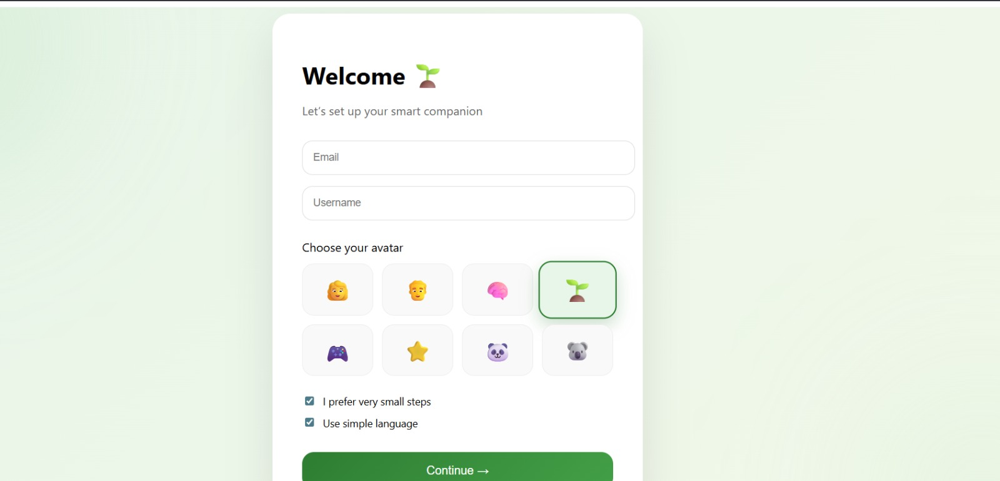
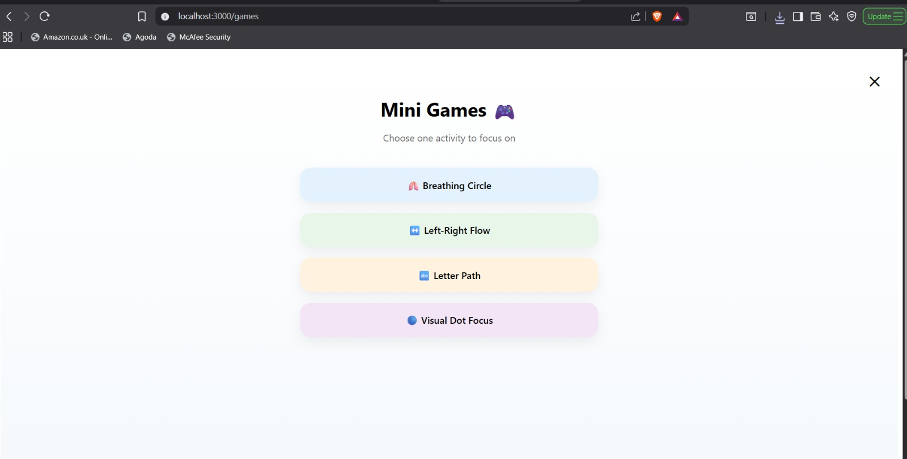
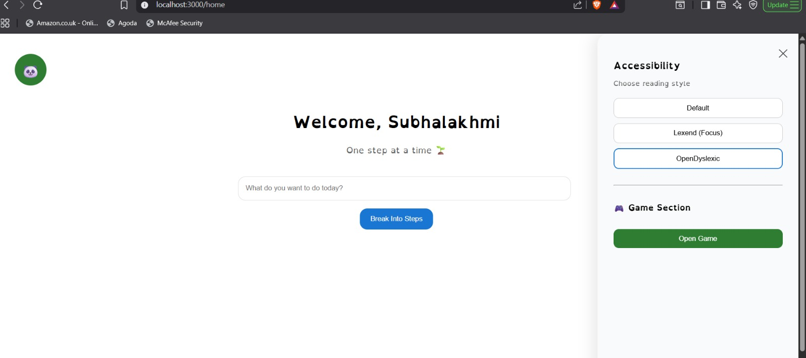
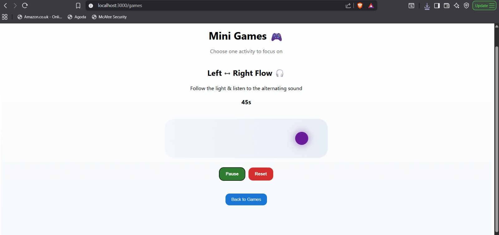

🌱 Smart Companion

An AI-powered productivity companion designed for focus, clarity, and accessibility — featuring intelligent task decomposition, voice guidance, and cognitive support tools.

✨ Features

🧠 AI-based task breakdown into manageable micro-steps

🔊 Voice guidance using Text-to-Speech

🎮 Focus-enhancing mini games

🌿 Accessibility settings (font modes, simplified language)

👤 User onboarding & profile customization

📦 Full-stack architecture (Next.js + FastAPI)

🛠 Tech Stack

Frontend

Next.js

React

Custom hooks for speech & accessibility

Backend

FastAPI

SQLite

Docker support

🚀 How to Run Locally
1️⃣ Backend
cd backend
uvicorn app:app --reload

Backend runs on:
http://localhost:8000

2️⃣ Frontend
cd ui
npm install
npm run dev

Frontend runs on:
http://localhost:3000

🐳 Docker (Optional)
docker-compose up --build
🎯 Vision

Smart Companion is built to reduce overwhelm and support neuro-friendly productivity by transforming complex tasks into clear, actionable steps.

## 📸 Screenshots

### 🏠 Home

### 🌱 Onboarding

### 🎮 Games Section

### 🧠 Accessibility

### 👤 Edit Profile

### 🔁 Left Right Flow Game

